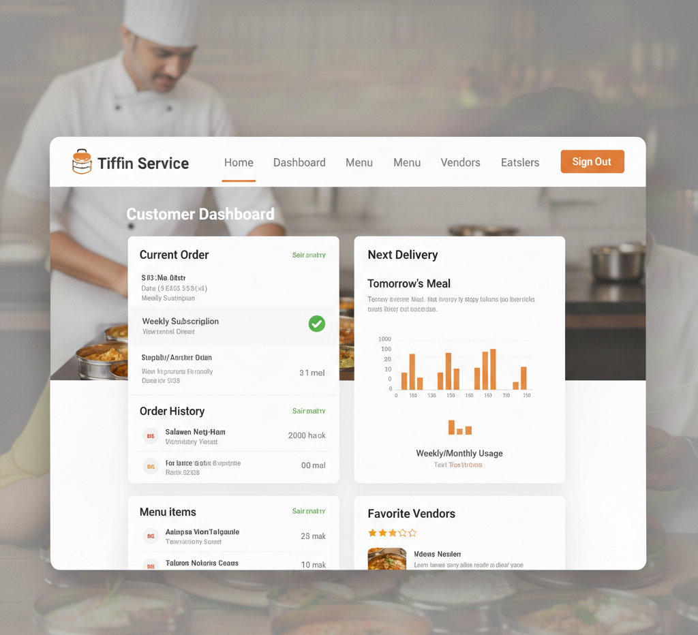

# Tiffin Service Website

A Django-based web application that connects tiffin providers (home cooks) with customers who want to order fresh, homemade meals.

## Features

### For Customers:
- Browse tiffin services by location, cuisine, and dietary preferences
- View detailed menus with photos and reviews
- Add items to cart and place orders
- Track order status and delivery
- Rate and review tiffin services

### For Providers:
- Create business profile with service details
- Add and manage tiffin offerings
- Receive and manage customer orders
- Update order status in real-time
- View earnings and customer feedback

### Admin Features:
- Manage users, providers, and orders
- Monitor platform activity
- Handle disputes and support

## Technology Stack

- **Backend**: Django 4.2.7, Python
- **Database**: MySQL
- **Frontend**: Bootstrap 5, HTML5, CSS3, JavaScript
- **Image Handling**: Pillow
- **Forms**: Django Crispy Forms

## Installation & Setup

### Prerequisites
- Python 3.8 or higher
- MySQL Server
- Git

### Step 1: Clone the Repository
```bash
git clone <your-repository-url>
cd tiffin
```

### Step 2: Create Virtual Environment
```bash
python -m venv venv
# On Windows:
venv\Scripts\activate
# On macOS/Linux:
source venv/bin/activate
```

### Step 3: Install Dependencies
```bash
pip install -r requirements.txt
```

### Step 4: Database Setup
1. Create a MySQL database named `tiffin_service`
2. Copy `.env.example` to `.env` and update database credentials:
```bash
cp .env.example .env
```

Edit `.env` file:
```
SECRET_KEY=your-secret-key-here
DEBUG=True
DB_NAME=tiffin_service
DB_USER=your_mysql_username
DB_PASSWORD=your_mysql_password
DB_HOST=localhost
DB_PORT=3306
```

### Step 5: Run Migrations
```bash
python manage.py makemigrations
python manage.py migrate
```

### Step 6: Create Superuser
```bash
python manage.py createsuperuser
```

### Step 7: Collect Static Files
```bash
python manage.py collectstatic
```

### Step 8: Run Development Server
```bash
python manage.py runserver
```

Visit `http://127.0.0.1:8000` to access the application.

## Usage Guide

### Getting Started as a Customer:
1. Sign up with user type "Customer"
2. Browse available tiffins in your area
3. Add items to cart and checkout
4. Track your orders in the dashboard

### Getting Started as a Provider:
1. Sign up with user type "Provider"
2. Create your business profile
3. Add your tiffin services with photos and details
4. Manage incoming orders from your dashboard

### Admin Access:
Visit `http://127.0.0.1:8000/admin` to access the Django admin panel.

## Project Structure

```
tiffin/
├── accounts/           # User management and authentication
├── tiffins/           # Tiffin services and menu management
├── orders/            # Order processing and management
├── templates/         # HTML templates
├── static/           # Static files (CSS, JS, images)
├── media/            # User uploaded files
├── tiffin_service/   # Main Django project settings
├── manage.py         # Django management script
├── requirements.txt  # Python dependencies
└── README.md        # This file
```

## Key Models

### User (Custom User Model)
- Extends Django's AbstractUser
- Supports both Customer and Provider user types
- Includes profile information and contact details

### ProviderProfile
- Business information for tiffin providers
- Delivery areas and pricing details
- Rating and order statistics

### TiffinService
- Individual tiffin offerings
- Menu details, pricing, and availability
- Categories and dietary information

### Order & OrderItem
- Order management and tracking
- Payment status and delivery details
- Item-wise order breakdown

## API Endpoints

### Main URLs:
- `/` - Home page
- `/tiffins/` - Browse all tiffins
- `/accounts/login/` - User login
- `/accounts/signup/` - User registration
- `/accounts/dashboard/` - User dashboard
- `/orders/cart/` - Shopping cart
- `/orders/history/` - Order history

## Contributing

1. Fork the repository
2. Create a feature branch
3. Make your changes
4. Test thoroughly
5. Submit a pull request

## Troubleshooting

### Common Issues:

1. **Database Connection Error**
   - Ensure MySQL server is running
   - Check database credentials in `.env` file
   - Verify database exists

2. **Static Files Not Loading**
   - Run `python manage.py collectstatic`
   - Check `STATIC_URL` and `STATIC_ROOT` in settings

3. **Image Upload Issues**
   - Ensure `MEDIA_ROOT` directory exists
   - Check file permissions

4. **Migration Errors**
   - Delete migration files and run `makemigrations` again
   - Reset database if needed

## Security Notes

- Change `SECRET_KEY` in production
- Set `DEBUG=False` in production
- Use environment variables for sensitive data
- Implement proper SSL/HTTPS in production
- Regular security updates

## 🖼️ Visual Interface (UI/UX)

Below are the design mockups for the Tiffin Service platform. You can find these assets in the `/static/images/screenshots/` directory.

### 1. Home Page
The landing page features a hero section with a search bar, categories for customers/vendors, and a "Favorite Meals" showcase.


### 2. Authentication (Login & Signup)
A clean, split-screen design. The signup page includes a specific dropdown to select between **Customer** and **Vendor** roles.
| Login Page | Signup Page |
| :--- | :--- |
|  |  |

### 3. Vendor Dashboard
Provides providers with real-time analytics on earnings, active orders, and menu management tools.


### 4. Customer Dashboard
Allows customers to track their "Next Delivery," view order history, and manage their favorite tiffin providers.


## License

This project is licensed under the MIT License.

## Support

For support and questions, please contact [jakhaniyasandip41@gmail.com]

---

**Happy Cooking & Ordering! 🍽️**
